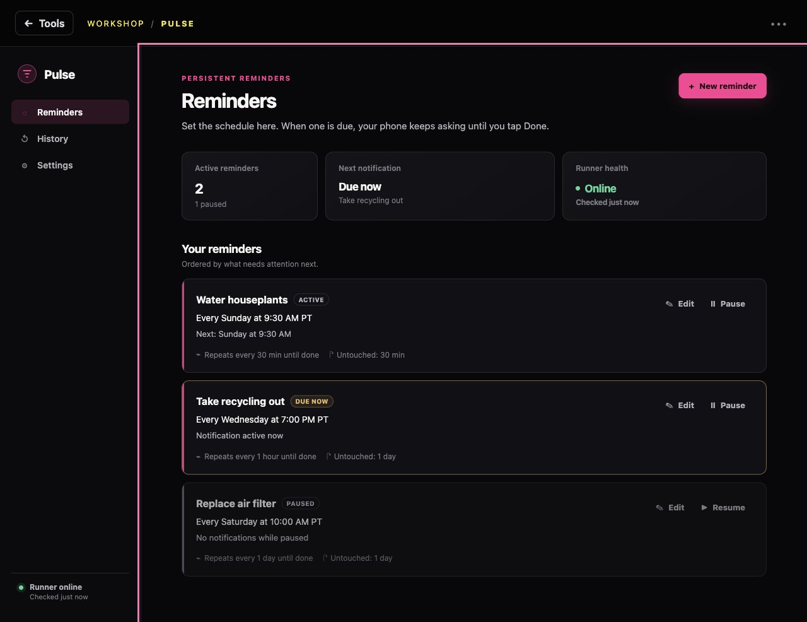
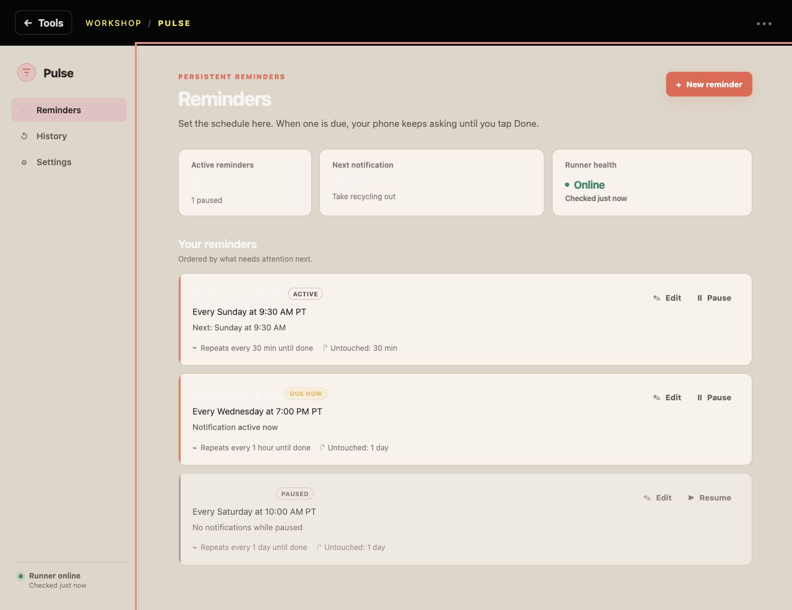
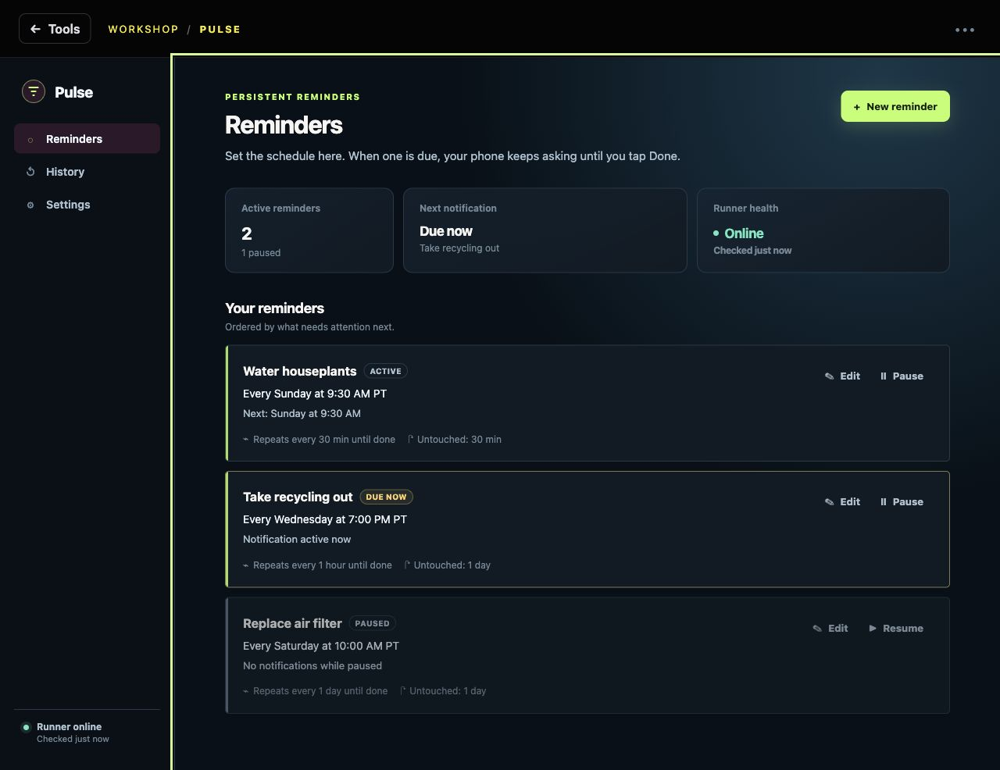
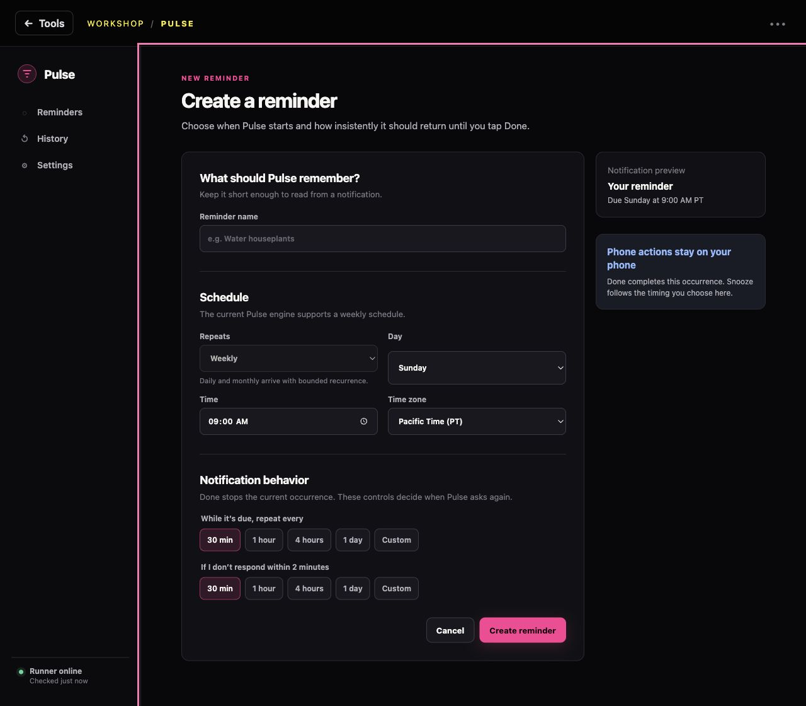
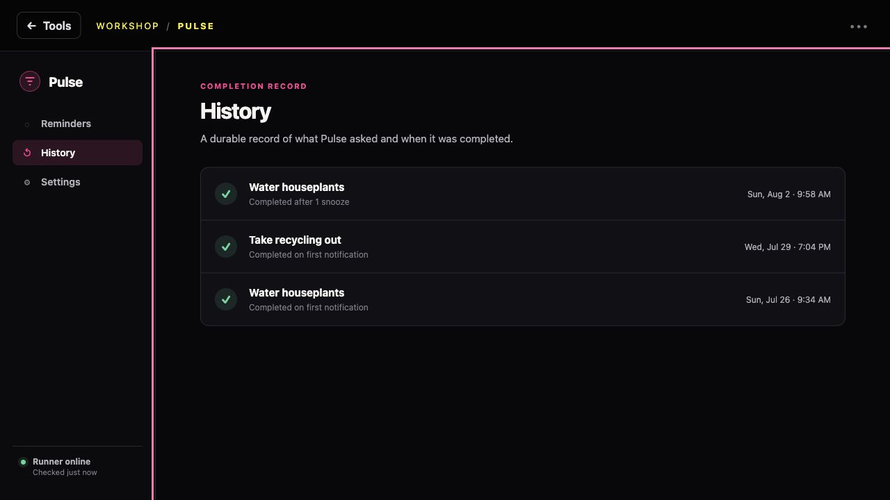
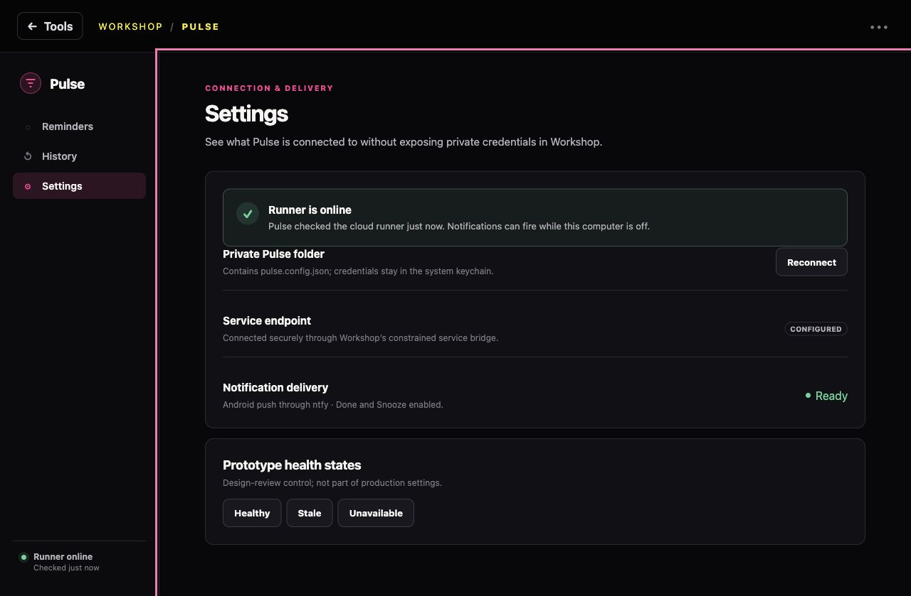

# Pulse D0 Design Evidence

> The newer guided bring-your-own-service setup study lives in
> [`guided-setup-README.md`](guided-setup-README.md), with three complete G1
> experience directions, the [fresh nine-reviewer retest](usability-council/round-2/synthesis.md),
> and evidence in `onboarding-evidence/`. This document
> remains the decision record for Pulse's reminder-management UI.

This directory contains a public-safe, fixture-driven prototype for the Pulse
Workshop plugin. It never connects to the private runner and contains no real
reminders, tokens, topics, paths, or completion history.

## Run it

From the Pulse repository root:

```sh
python3 -m http.server 4178 --bind 127.0.0.1 --directory design/prototype
```

Open `http://127.0.0.1:4178/#/compare`.

## Visual directions

Pulse is designed desktop-first for Workshop on a Mac laptop. The 1440px
evidence set is the primary approval surface: it uses persistent navigation,
compact summary information, a two-column form/preview layout, and keyboard-safe
management actions. The narrow evidence proves the app reflows safely; it does
not drive the desktop composition.

1. **Quiet Focus — selected.** Near-black surfaces, restrained density, and a
   single vivid Pulse accent. It fits Workshop without imitating Workshop's
   internal components and keeps personal reminders from feeling clinical.
2. **Soft Ledger.** Warm paper-like surfaces and coral action color. Attractive,
   but the light canvas creates a jarring handoff from the dark Workshop host.
3. **Signal Grid.** Sharper geometry and lime telemetry accents. Legible and
   modern, but it makes a personal reminder product feel like infrastructure
   monitoring.

The selected direction is a deliberate synthesis: Things-like calm and
progressive disclosure, Linear-like alignment and density discipline, and a
native desktop control rhythm. It does not copy their branding or product
models.

## Rendered evidence

### Selected desktop direction



### Alternative full-screen directions

| Soft Ledger | Signal Grid |
| --- | --- |
|  |  |

### Core management flow

| Create | History | Settings |
| --- | --- | --- |
|  |  |  |

The `evidence/` directory also contains desktop and 390px safety renders for
empty, editing, setup, setup-error, history-empty, stale-runner, and
unavailable-runner states. The narrow renders prove reflow; desktop remains the
approval target.

## Prototype routes

| Route | Evidence |
| --- | --- |
| `#/compare` | Three full visual directions and the recommendation. |
| `#/reminders` | Populated home, summary, health, active/due/paused cards. |
| `#/empty` | Connected empty state. |
| `#/new` | New reminder flow and timing presets/custom control. |
| `#/edit/water-plants` | Editing, history-preservation copy, delete confirmation. |
| `#/history` | Populated completion history. |
| `#/history-empty` | Empty completion history. |
| `#/settings` | Connection/delivery summary and healthy/stale/down controls. |
| `#/setup` | Disconnected setup and recoverable connection error. |

## Component inventory

- Workshop preview frame: visual context only, not a Workshop implementation.
- Pulse shell: responsive sidebar/top navigation, brand mark, runner-health cue.
- Page header, summary cards, reminder card, status badge, health callout.
- Primary, secondary, quiet, and destructive buttons.
- Labeled field, select, segmented timing presets, custom timing disclosure.
- Empty state, history row, settings row, toast, confirmation dialog.

All selectors are Pulse-owned and namespaced by context. Production must use
the same accessibility contract but should split these into React components
rather than copy the prototype's string templates.

## Design decision record

- Workshop owns the outer host. Pulse owns everything inside the plugin view.
- Phone notifications own occurrence-level Done and Snooze. Workshop owns
  definition setup, editing, pausing, deletion, health, and history.
- Weekly is the only enabled cadence because that is the current engine truth.
  The form reserves a visible recurrence location and explains the limitation.
- Reminder cards state schedule, next notification, repeat-until-done timing,
  and unattended timing in plain language.
- Machine states are always translated into readable text with a color/icon
  reinforcement.
- The prototype uses public fixture obligations only.

## Production promotion

Quiet Focus has been promoted into the exported React plugin in `plugin/src`.
This prototype remains a public-safe comparison and state catalog; it is not
loaded by Workshop and has no private-service access. Production behavior and
its test gates are tracked in `docs/pulse-product-redesign.md`.
